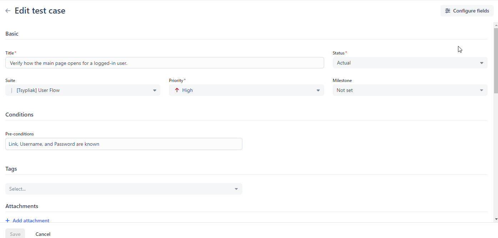
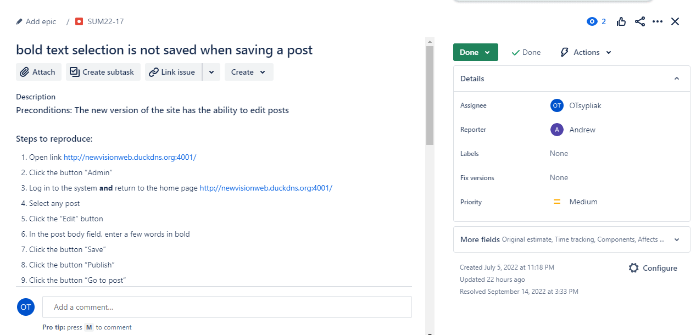
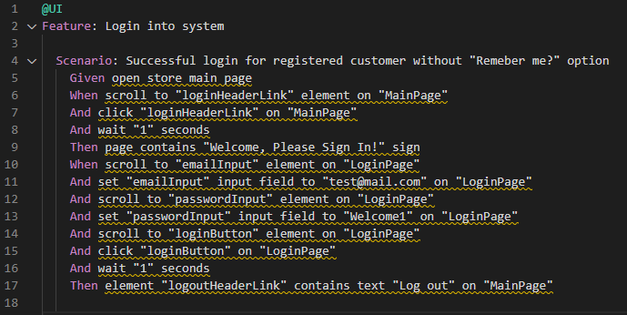
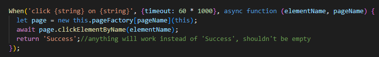
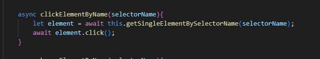
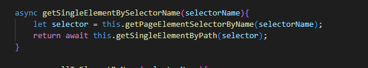
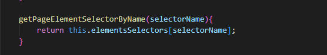
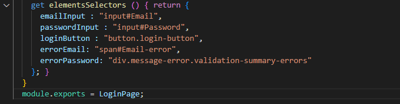

# Portfolio
- [About me](#about-me)
- [CV](#cv)
- [Skills](#skills)
- [Tools](#tools)
- [Education](#education)
- [Examples of my work](#examples-of-my-work)
  * [Test case and work in Qase](#test-case-and-work-in-Qase)
  * [Bug report and work in Jira](#bug-report-and-work-in-jira)
  * [Test run in Postman](#test-run-in-Postman)
  * [Scenario in framework on CucumberJs](#scenario-in-framework-on-cucumberjs)
  * [Implements function click](#implements-function-click)
- [Books I have read](#books-i-have-read)

## About me

I'm a QA Engineer who has 9 monthes experience in manual QA engineer for web applications and 6 monthes in UI/API authomated testing. 

I started my IT journey with Manual Testing, working on web apps in blogging, education, and marketing. I used Jira & Qase for managing test documentation.

I also have some experience in Automation testing, where I worked on tests for an e-commerce platform. I used tools such as CucumberJS, WebDriver IO, and Axios.

Additionally, I'm good at keeping things organized, familiar with the Agile way of working using SCRUM and Kanban, and I understand concepts of REST API, OOP, JSON, XML, HTML, and CSS.

I enjoy learning, and my focus is on improving in testing and quality assurance. I'm looking for opportunities to develop and contribute my skills.

## CV
You can download my CV as [a PDF from my Google Drive](CV.pdf).

## Skills

You can find examples of the described skills in the [Examples of my work](#examples-of-my-work) section.

__Technical experience:__
  * Adding/editing UI/API tests in custom NodeJS BDD automation framework based on CucumberJS, WebDriverIO and Axios for e-commerce product
  * Writing test documentation for blogging, educational and marketing web applications:
   * Test cases
   * Bug reports
   * Check-lists
   * Test plans
  * Test-design techniques usage:
   * Equivalence Partitioning
   * Boundary Value Analysis
   * Ad-hoc Testing etc
  * API testing using Postman
  * API structure analysis using documentation in Swagger
  * Working with Jira, Qase for adding and editing test cases, bug reports, test plans
  
__Strengths:__
  * Accuracy and attention to details
  * Analytical Thinking and problem solving skills
  * Team-oriented mindset with ability to unite people to achieve a goal

## Tools

  * NodeJS frameworks: CucumberJS, WebDriverIO, Axios
  * Postman
  * GitBash
  * MS SQL questing for testing purposes testing e-commerece
  * Visual Studio Code (for IDE) as an editor with syntax highlighting for the Gherkin        language, which simplifies managment of feature files
  * Jira
  * Qase
  * Jenkins pipelines usage for:
   * Test framework versioning on GitHub
   * Running framework  tests for e-commerce product

## Education
  
  * Bachelor degree in system engineer (Vinnytsia National Technical University)
  * 9-month course with personal mentoring on theory and practice of manual testing based on real web applications
  * 6-month course with personal mentoring  on theory and practice of automation testing using a custom framework based on CucumberJS, WebDriver IO and Axios, testing the UI and API of the application after BDD
  * Основи тестування програмного забезпечення (Lviv IT School) (https://prometheus.org.ua/course/course-v1:LITS+115+2017_T4)
  * SQL Basics courses (https://sqlbolt.com/) 
  * JavaScript with Sololern (https://www.sololearn.com/en/learn/languages/javascript)

## Examples of my work

### Test cases and work in Qase: 
   
- Test case to check how the main page opens for a logged-in user in the Quasigalley Blog application:

### Bug report and work in Jira

-

### Test run in Postman:

- Test run in Postman in QuizSpike application

 

### Scenario in framework on CucumberJs

- A simple positive login verification scenario

 
 
### Implements function click:

- For example, like on lines 7 and 15 from the script in the previous screenshot

- The clickElementByName(elementName) function, in turn, is implemented like this

- the click function is from the WebDriverIO framework, and the getSingleElementBySelectorName(selectorName) function is implemented like this

- functions getPageElementSelectorByName(selectorName) and getSingleElementByPath(selector) are implemented as follows

- a web element in each class is defined (for example in LoginPage):

## Books I have read
__"Software Testing - Base Course"__ by Svyatoslav Kulikov 
__"Software Testing Revealed"__  by International Software Test Institute